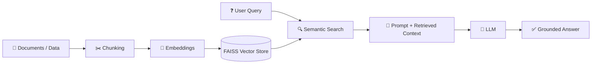
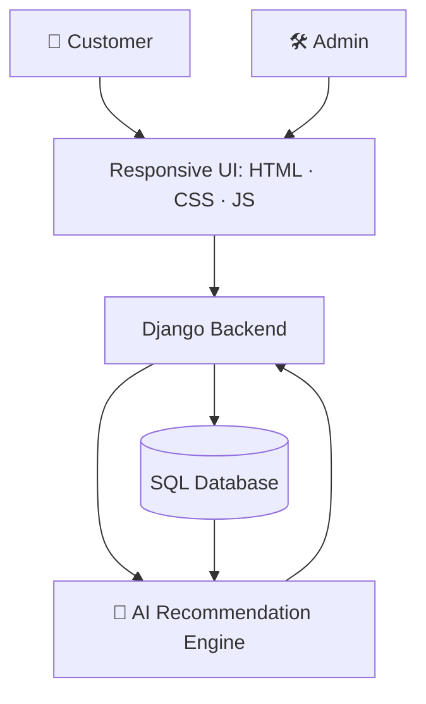

# Hi, I'm Yashwanth K 👋

I build **database-driven web apps** and **AI-powered products**, from Django backends to RAG chatbots that ground LLM answers in real documents instead of guessing.

---

## 👨‍💻 About Me

| | |
|---|---|
| 🎓 **Education** | B.E. Information Science & Engineering, Ghousia College of Engineering (VTU), 2022 – 2026 |
| 💼 **Experience** | Python Full Stack Trainee @ Palle Technologies · Data Science Intern @ Palle Consulting Services |
| 🧠 **Focus** | LLMs, Retrieval-Augmented Generation, NLP, Machine Learning |
| 🌐 **Full Stack** | Django · Flask · REST APIs · MySQL · HTML/CSS/JavaScript |
| 📍 **Location** | Karnataka, India |
| 🔎 **Status** | **Open to work**: Python Full Stack, Software Engineering, AI/ML roles |

---

## 🤖 AI Engineering Focus

I work at the intersection of **backend engineering and applied AI**. My goal is not just to call an LLM API, but to build the full system around it: data ingestion, retrieval, grounding, serving, and evaluation.

### What I Work With

| Layer | Tools & Techniques |
|---|---|
| **LLMs & APIs** | OpenAI GPT, Gemini Flash, prompt engineering |
| **Orchestration** | LangChain (loaders, splitters, retrievers, chains) |
| **Embeddings** | Hugging Face `all-MiniLM-L6-v2`, sentence embeddings |
| **Vector Search** | FAISS with persistent index storage, semantic search |
| **Classical ML** | Scikit-learn: supervised and unsupervised learning, feature engineering, model evaluation |
| **Deep Learning** | TensorFlow, Keras |
| **Data Science** | NumPy, Pandas, Matplotlib, EDA |
| **Serving** | Django / Flask backends, REST APIs |

---

## 📂 Featured Projects

### 🤖 TCS Chatbot: RAG-Based Generative AI Chatbot

A document-aware chatbot that answers questions **using only your uploaded files as the source of truth**, which reduces hallucination and keeps responses verifiable.

**How it works**

1. **Ingest:** PDFs are loaded with `PyPDFLoader`
2. **Chunk:** `RecursiveCharacterTextSplitter` splits text into retrieval-friendly passages
3. **Embed:** `all-MiniLM-L6-v2` (Hugging Face) converts chunks to vectors
4. **Store:** vectors are saved in a **persistent FAISS index** (no re-embedding on every restart)
5. **Retrieve:** the user's question is embedded and matched against the index by semantic similarity
6. **Generate:** OpenAI GPT answers using the retrieved passages as context

**Stack:** `Python` `LangChain` `OpenAI GPT` `RAG` `Hugging Face` `FAISS`

---

### 🛒 NexTrade: AI-Powered E-Commerce Platform

A full-stack e-commerce platform with separate **customer** and **admin** modules and an **AI product recommendation** feature.

- **Customer module:** browsing, cart, wishlist, orders, saved addresses
- **Admin module:** product and inventory management, order handling
- **Backend:** Django models and SQL integration for users, products, inventory, addresses, and orders
- **AI layer:** product recommendations surfaced directly in the storefront

**Stack:** `Python` `Django` `SQL` `HTML` `CSS` `JavaScript`

---

### 🩺 Diabetes Prediction Using Machine Learning

A supervised classification pipeline that predicts diabetes from patient health data, built to compare algorithms rather than assume one.

| Step | What I did |
|---|---|
| **EDA** | Explored distributions, correlations, and data quality with Pandas and Matplotlib |
| **Feature engineering** | Prepared and transformed features for training |
| **Modeling** | Logistic Regression · K-Nearest Neighbors · Naive Bayes · Random Forest |
| **Evaluation** | Compared models side by side to select the best performer |

**Stack:** `Python` `Pandas` `NumPy` `Scikit-learn` `Matplotlib`

> 🔗 **Repo links:** replace this line with `[View Code](https://github.com/Yashwanth-12-yash/<repo-name>)` for each project.

---

## 💼 Experience

### Python Full Stack Trainee: Palle Technologies, Bengaluru
*Dec 2025 – Jun 2026*
- Built full-stack web applications with Python, Django, SQL, HTML, CSS, and JavaScript
- Connected backend logic and database-driven features to user-facing interfaces
- Strengthened application architecture, database design, and debugging through hands-on projects

### Data Science Intern: Palle Consulting Services Pvt. Ltd., Bengaluru
*2026*
- Preprocessed datasets and ran exploratory analysis with Python, NumPy, Pandas, and Matplotlib
- Applied supervised and unsupervised ML to real-world datasets for predictive analysis
- Built end-to-end ML workflows: feature engineering, training, model comparison, and result interpretation

---

## 🛠️ Tech Stack

**Languages & Backend**

**Frontend**

**Database**

**Generative AI & LLMs**

**Machine Learning & Data Science**

**Tools**

---

## 🧭 How I Build AI Features

1. **Start from the data problem**: what does the model need to know, and where does it live?
2. **Ground before you generate**: retrieval first, so answers trace back to a source
3. **Compare, don't assume**: benchmark several approaches before committing (as in my diabetes project)
4. **Persist and reuse**: cache embeddings and indexes so apps start fast and cost less
5. **Wrap it in a real product**: AI behind clean APIs and usable interfaces, not just notebooks

---

## 🌱 Currently Exploring

- 🔭 More advanced RAG: better chunking, re-ranking, and answer evaluation
- 🧠 Deep learning with TensorFlow and Keras
- ⚙️ Production-ready Django REST APIs for serving ML and LLM features
- ☁️ Deploying AI apps end to end

---

## 📊 GitHub Stats

---

## 📫 Let's Connect

Interested in **Python, Django, GenAI, or RAG systems**? Let's talk.

📧 **yashwanthk2004k@gmail.com** · 💼 [LinkedIn](https://linkedin.com/in/yashwanthk2004) · 🐙 [GitHub](https://github.com/Yashwanth-12-yash)

⭐ If you like my work, drop a star on my repos!

